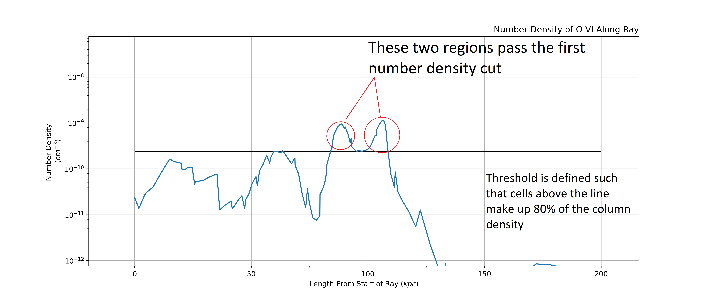
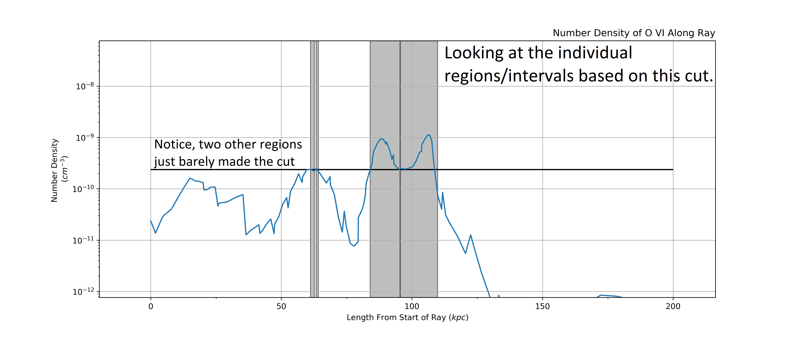
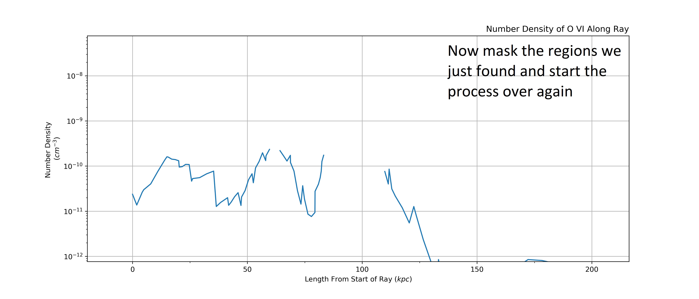
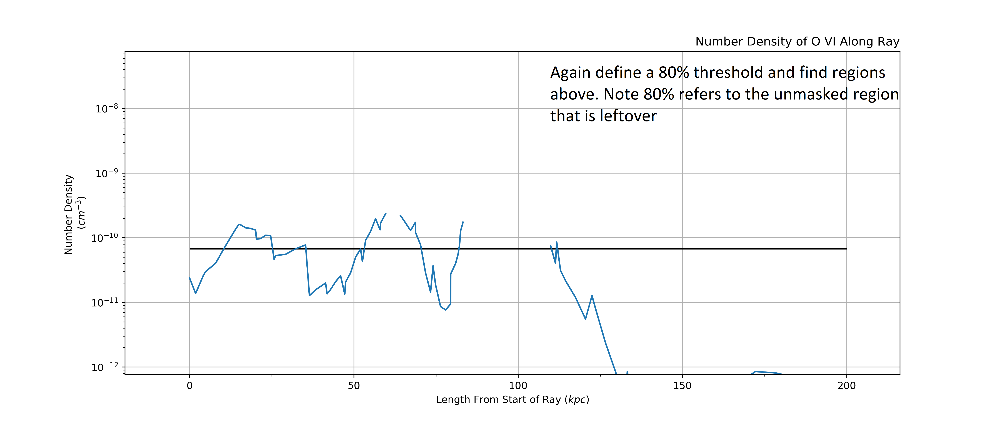
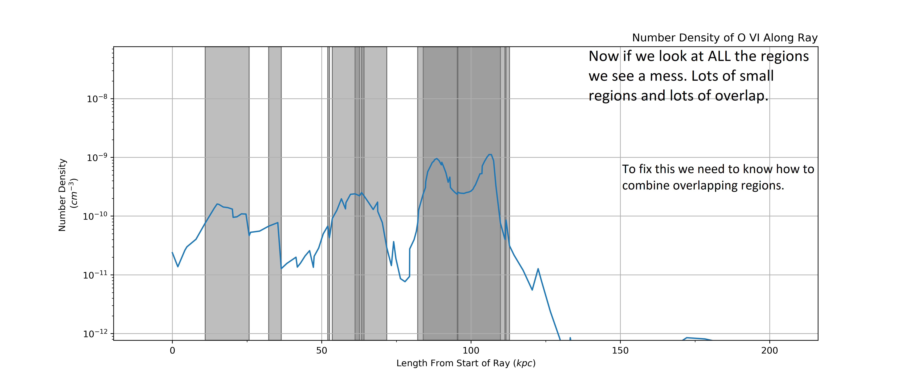
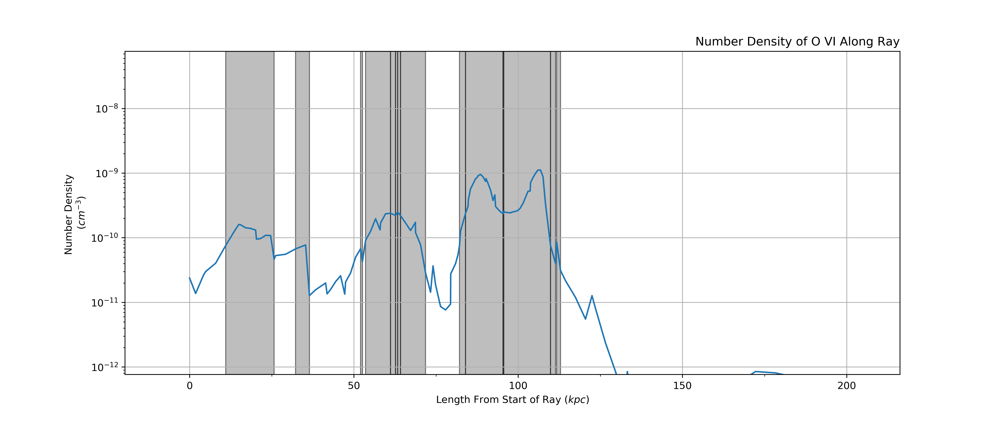
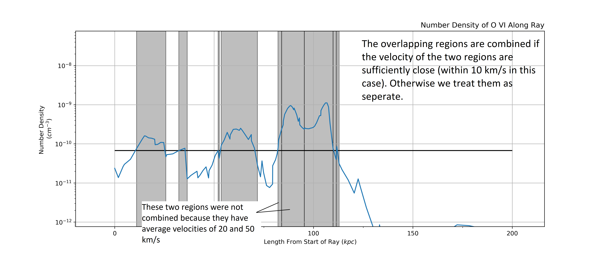
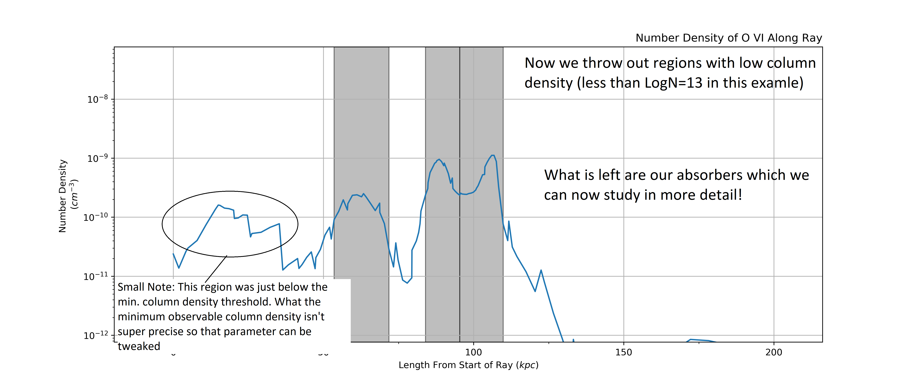

.. _absorber-extraction:

Absorber Extraction
====================

The main purpose of salsa is to extract absorbers from lightrays. Doing this
allows us to create synthetic absorption line catalogs/surveys in an analogous
fashion as real observational surveys. There are two methods which salsa can
extract absorbers: (1.) The SPICE method which looks directly at cell level data
of the simulation.  (2.) Spectacle method which uses the python package
`Spectacle <https://spectacle-py.readthedocs.io/>`_ to fit Voigt
profiles to synthetic spectra that is generated by
`Trident <https://trident.readthedocs.io/>`_, another open-source python package.

.. _spice-method:

SPICE Method
-------------
The SPICE (Simple Procedure for Iterative Cloud Extraction) method looks at a trident lightray and
attempts to extract "absorbers" by identifying contiguous groups of cells along
the ray that will contribute to observable features in the absorption spectra.

The algorithm that does this is an iterative process and for a more detailed and
likely easier to comprehend explanation see :ref:`detailed-spice-method`. But here is a
rundown of how the algorithm functions to extract absorbers from a light ray

Quick rundown of SPICE method:

  1.) Find cutoff in number density such that 80% of the column density is
  contained in cells with number density above this threshold.

  2.) Define intervals that encompass the cells which meet this cutoff.

  3.) Mask the intervals along the lightray that  were found in the previous step

  4.) Repeat same step as (1.). Find the 80% cutoff based on the column density
  *left over*.

  5.) define intervals just as (3.)

  6.) Take all the intervals that have been found and sensibly combine all of
  them together. We do this by combining overlapping intervals **if** the average
  velocity of each intervals are within a threshold (set by
  :class:`~salsa.AbsorberExtractor.velocity_res` parameter. Default is 10 km/s)

  7.) Now repeat process starting at step 3 until the total column density that
  is *left over* in the lightray (ie not in an interval) is less than some
  the lowest detectable column density (set by :class:`~salsa.AbsorberExtractor.min_absorber`
  parameter. Default is Log(N)=13, though it can vary based on ion)

  8.) Finally, we check whether each interval meets the detectable column density
  threshold. We return only the intervals that are above the threshold and define
  these to be our absorbers.

.. _spectacle-method:

Spectacle
----------

This method utilizes trident's feature of creating synthetic spectra from a
light ray object as well as spectacle's ability to fit lines to these spectra.
For more details about how Spectacle works and specifically how it runs fits see
`Spectacle: Line Finding
<https://spectacle-py.readthedocs.io/en/latest/line_finding.html>`_ and
`Spectacle: Fitting <https://spectacle-py.readthedocs.io/en/latest/fitting.html>`_

.. _detailed-spice-method:

Detailed SPICE Example
-----------------------------

If you want a better understanding of how the SPICE method works, here is a real
life example. We break down each step of the method so you can see the under
workings and see how some of the parameters may impact the algorithm.

Here is our lightray, looking at the number density of O VI along its
length. Our goal is to find regions/intervals of cells along the lightray
with the highest column density and thus will meaningfully contribute to the
absorption spectra of the lightray.

.. image:: /_static/annotated_schematic/01-ray.png

The first step is to find a cutoff value in number density such that cells above
this cutoff make up 80% of the column density. This isolates the regions with
very high number density. Below we can see two main regions that will likely be
the largest absorbers.

.. note::
  This 80% value is just the default value and can be tweak. We have found that
  the algorithm is fairly insensitive to this value. To change it, change the
  :class:`~salsa.AbsorberExtractor.frac` parameter in :class:`~salsa.AbsorberExtractor`

Next we define intervals that cover each region based on the cut. This leads us
to 4 different regions, 2 small ones right next to eachother, and the two large
ones that we could spot pretty easily from just eye balling it.

Now we mask the intervals we found witht he first cutoff and check there is
enough column density remaining in the lightray. We find there is LogN=13.3
remaining in the lightray. We use a threshold for LogN=13 in this example so we
continue to iterating through.

.. note::
  The LogN=13 threshold is set by the :class:`~salsa.AbsorberExtractor.absorber_min` 
  parameter. This sets the minimum detectable columne density for an absorber
  and so can vary based on ion and the research goals.

Here we define a new cut based on what is "left over" of the lightray. This
isolates some new regions that were at a lower column density but could still
significantly contribute to the spectra, and so something we want to extract.

Again we extract intervals based on the cut. This time some of the intervals
overlap masked regions. This is OK and will be dealt with in the "sensible
combination" phase that comes next.

Combining all of the intervals from the two sets of cuts we are left with a bit
of a mess. The first step is to divide up any regions with overlapping intervals
into smaller component parts and then we will recombine them into sensible
intervals that capture observationally distinct absorbers.

Now that we have separated the overlapping regions we can decide on which
intervals to combine. We do this by taking into account the line of sight
velocity information.

We calculate the average velocity of each interval and then combine two
intervals if their velocities are with in a certain threshold, 10 km/s in this
example.

.. note::
  The velocity threshold that defines whether intervals/regions are combined is
  set by :class:`~salsa.AbsorberExtractor.velocity_res`. The value is motivated by the
  resolution of observed spectra though we have found the algorithm to be fairly
  insensitive to the precise value, especially when looking at a catalog of
  absorbers.

Here are the remaining intervals after our combining phase. You can see that
some of the overlapping intervals were combined (like around 60 kpc) while
others were separated/remained separated (like the two large absorbers at 100
kpc were not combined and some small ones on either side where not combined).

Now we again mask the regions with intervals and calculate how much column
density is "left over". In this case we find that there is only LogN=12.7 which
is beneath our minimum absorber threshold of LogN=13.

So, we stop iterating through the ray and do a final cleanup of the intervals by
throwing out all the intervals with "low column density" (based on
:class:`~salsa.AbsorberExtractor.absorber_min`). This leaves us with the absorbers
which can be further studied by extracting other information about them (e.g.
temperature, radial velocity, metallicity, etc.).

