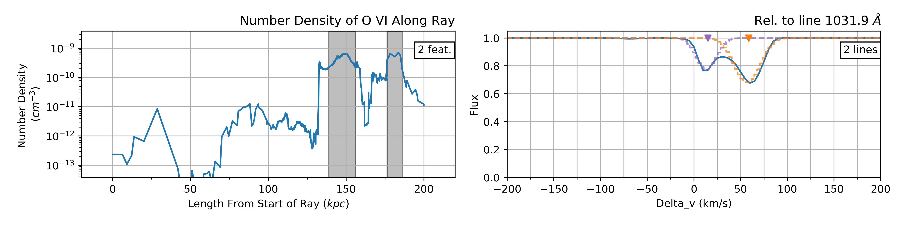

# Summary

The hot, low density gas surrounding galaxies, called the circumgalactic medium (CGM), is vital to understanding the structure and evolution of galaxies [@Tumlinson:2017]. The diffuse nature of the CGM makes it difficult to observe by direction detection in emission, so much of our understanding comes from studying absorption line features in the spectra of light from distant quasars that pass through intervening galaxies [@Howk:2017; @Lehner:2018]. Since a single quasar sightline only contains a relatively small amount of information, observational astronomers conduct surveys to collect many sightlines and create large absorber catalogs that contain information about the variety of absorption lines found in each individual sightline. These catalogs create a statistical picture of the CGM and have proved invaluable in our understanding of the dynamics in the CGM.

As a complement to observational surveys, hydrodynamic simulations have also become increasingly important for studying the CGM and efforts have been made to apply absorption line analysis to simulated data [@Smith:2011; @Egan:2014; @Peeples:2019]. Trident is a Python package that can extract an artificial sightline, referred to as a “LightRay” in the code, from simulation data and then generate synthetic spectra from that sightline [@Hummels:2017]. This provides the opportunity to explore a simulation from an observer’s perspective, which facilitates making direct comparisons to observational studies. In this way, Trident provides a new avenue of study for simulators. However, a straightforward, streamlined process for replicating observational absorber catalogs is not yet readily available.

In order to fill this void, we introduce the Python package, SALSA (Synthetic Absorption Line Surveyor Application). SALSA is a package that generates synthetic absorber catalogs by studying the LightRays and/or spectra generated using Trident. SALSA provides an automated pipeline to process large numbers of LightRays and extract absorber information into a catalog for further analysis. Two separate methods are made available to extract absorbers. The “Spectacle method” uses the Python package Spectacle to fit Voigt profiles to the synthetic spectra generated by Trident (see \autoref{fig:1}) [@spectacle:2019]. This method provides traditional absorption line information (e.g. Doppler broadening, equivalent width, etc.) and thus creates synthetic absorber catalogs very similar to those made from observational studies.

The “SPICE (Simple Procedure for Iterative Cloud Extraction) method” is a novel method that uses cell level data from the simulation to find the contiguous groups of cells which will meaningfully contribute absorption line features to the synthetic spectra. It does this through an iterative process that isolates the regions along the LightRay with the highest number density values and returns those regions with observationally detectable column densities as individual absorbers (see \autoref{fig:1}). This method provides direct access to the information contained in the simulation (e.g. temperature, velocity, metallicity, etc.) and, in turn, more information than can be provided by spectral absorption line analysis alone.

Each method has its own advantages and disadvantages depending on the research goals. Spectacle extracts absorbers in a way that is much more analogous to that of observational studies and thus can more easily be used to make “apples-to-apples” comparisons between simulations and observations. The SPICE method, on the other hand, retains much of the additional information provided by simulation data, allowing for more in-depth analysis of the properties of absorbers and how those relate to the simulated galaxy as a whole.

Once a synthetic absorber catalog is generated, analysis of the data can proceed from an observer’s perspective. Coupling this analysis with the unprocessed simulation data can bring powerful insights about how the CGM functions and how observations might provide a limited view into this complex medium. Current research efforts are leveraging SALSA to study O VI absorbers in the CGM. Further work will assuredly provide more discoveries and better connect the cutting-edge research done by computational and observational astronomers studying the CGM.

# Figures

Figures can be included like this:

and referenced from text using \autoref{fig:example}.

# Acknowledgements

We acknowledge contributions from Funding places and other peoples.

# References
